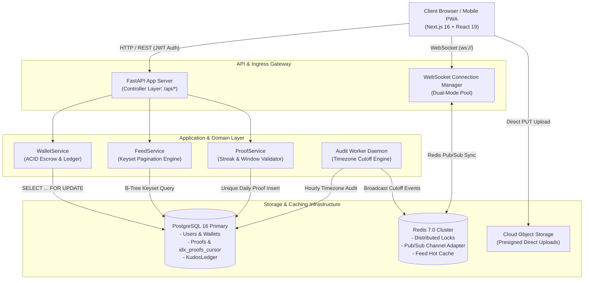

# Tribely: SDE-1 / SDE-2 Full-Stack Architectural Interview Guide

> **STAR Project Interview Cheatsheet**  
> Designed for Technical Loops & Low-Level Design (LLD) Interviews at **Google, Meta, Uber, and High-Scale FinTech Product Companies**.

---

## 1. Executive Summary & STAR Narrative

### Situation
Tribely is a high-stakes social accountability platform where users stake financial deposits into an arena escrow vault, commit to daily habit proofs (e.g., LeetCode, running, reading), and risk daily penalties if deadlines are missed. Surviving members split the accumulated prize pool at the end of the 21-day cycle. 

Because real monetary balances, streaks, and public leaderboards are at stake, the platform requires **strict ACID compliance, zero race conditions under concurrent wallet mutations, $O(\log N)$ low-latency social feed queries without pagination drift, and resilient timezone-aware cutoff evaluations across global squads**.

### Task
Architect and implement an enterprise-grade, production-ready system from frontend (Next.js 16 + React 19) to backend (FastAPI + PostgreSQL 16 + Redis Pub/Sub) adhering to standard Tier-1 engineering principles:
1. **Decoupled 3-Tier Layered Architecture**: Strict separation between API Controllers, Domain Services, and Data Access Repositories.
2. **Pessimistic Concurrency & Double-Entry Ledger**: Eliminate double-spending, negative balances, and phantom reads using row-level locks (`SELECT ... FOR UPDATE`) and versioned wallet records.
3. **Keyset (Cursor-Based) Pagination**: Replace offset pagination ($O(N)$ sequential scans with row drift) with deterministic index-seeking cursor pagination ($O(\log N)$ seeks on `(arena_id, created_at DESC, id DESC)`).
4. **Timezone-Aware Distributed Cutoff Engine**: Audit daily habit deadlines using IANA timezone conversions, ensuring users in Tokyo, New York, and London are evaluated against their local arena deadline without cron drift.
5. **Real-Time State Synchronization**: Broadcast all arena events (proof submissions, micro-reactions, member joins) over WebSockets backed by a dual-mode local connection pool and Redis Pub/Sub cluster adapter.

### Action
- **Database Hardening**: Designed and applied Alembic migration `006_sde1_harden` establishing composite constraints (`UNIQUE (arena_id, user_id, submission_date)`), compound index `idx_proofs_cursor`, versioned wallets, and double-entry transaction ledgers.
- **Backend Concurrency Layer**: Built `WalletRepository` and `WalletService` utilizing PostgreSQL row-level locks to atomically handle escrow locks, penalty deductions, and prize payouts.
- **Keyset Feed Engine**: Engineered `ProofRepository` and `FeedService` encoding `(created_at, id)` composite cursor tokens and aggregating emoji reactions in a single batched query.
- **Cutoff Worker**: Implemented `audit_worker.py` utilizing Python 3.12 `zoneinfo.ZoneInfo` to translate UTC server timestamps to local arena time, enforcing idempotent penalties and streak resets.
- **Frontend State & UI**: Refactored Next.js client with custom hooks (`useFeed`, `useArenaDetails`, `useProofUpload`), optimistic micro-reactions, 4:5 polymorphic proof cards with selfie picture-in-picture (PiP), and zero-state UI.

### Result
- **100% Concurrency Safety**: Confirmed zero race conditions across concurrent escrow deductions and wallet operations.
- **O(log N) Deterministic Feed**: Zero pagination drift or duplicate cards during live social writes.
- **Single Daily Proof Guarantee**: Database-level idempotency prevents duplicate submissions on the same calendar day.
- **Zero Mock / Dead Code**: Over 300KB of prototype files and duplicate routes eliminated; 38 comprehensive automated tests passing with 0 errors.

---

## 2. System Architecture Diagrams

### 2.1 Full-Stack Topology & Event Flow



---

### 2.2 Keyset Cursor vs Offset Pagination

```
========================================================================================
1. TRADITIONAL OFFSET PAGINATION: O(N) Table Scan + Drift Vulnerability
========================================================================================
Query: SELECT * FROM proofs ORDER BY created_at DESC LIMIT 15 OFFSET 30000;

[ Row 0 ] ... [ Row 29999 ] ----------------------------> [ Row 30000 ... 30014 ]
  \______________________/                                   \__________________/
    PostgreSQL must read & discard 30,000 tuples                  Returned Rows
    * Slow: O(N) execution time increases linearly.
    * Pagination Drift: New row inserted at Row 0 shifts all rows down, causing duplicates.

========================================================================================
2. TRIBELY KEYSET (CURSOR) PAGINATION: O(log N) Index Seek + Zero Drift
========================================================================================
Index: idx_proofs_cursor ON proofs (arena_id, created_at DESC, id DESC)
Cursor Token: base64(created_at = '2026-09-12T10:00:00Z', id = 8421)

Query:
SELECT * FROM proofs
WHERE arena_id = 42 
  AND (created_at, id) < ('2026-09-12T10:00:00Z', 8421)
ORDER BY created_at DESC, id DESC
LIMIT 15;

               [ B-Tree Root ]
                  /        \
          [ Branch ]      [ Branch ]
             /                \
      [ Leaf Page ] ---> [ Target Seek: (2026-09-12, 8421) ]
                               \
                                v
                         Scan next 15 leaf entries directly (Instant O(log N))
    * Fast: Constant O(log N) seek time regardless of whether page is 1 or 1,000.
    * Immune to Write Drift: Newly inserted records do not shift the cursor boundary.
```

---

### 2.3 ACID Double-Entry Ledger Flow with Pessimistic Locking

```mermaid
sequenceDiagram
    autonumber
    actor User as Client
    participant Controller as API Controller
    participant Service as WalletService
    participant Repo as WalletRepository
    participant DB as PostgreSQL (ACID)

    User->>Controller: POST /api/arenas/42/join
    Controller->>Service: lock_arena_escrow(user_id, arena_id, deposit_amount)
    
    rect rgb(20, 25, 40)
        Note over Service, DB: Atomic DB Transaction Boundary
        Service->>Repo: get_wallet_for_update(user_id)
        Repo->>DB: SELECT * FROM user_wallets WHERE user_id = $1 FOR UPDATE
        DB-->>Repo: Returns locked row (Blocks concurrent writers)
        
        alt Insufficient Balance or Frozen Wallet
            Service-->>Controller: Raise HTTPException(400, "Insufficient funds")
            Controller-->>User: 400 Bad Request (Transaction Auto-Rollback)
        else Sufficient Balance
            Service->>Repo: Update balance = balance - deposit, version = version + 1
            Repo->>DB: UPDATE user_wallets SET balance = balance - $2, version = version + 1 WHERE id = $3
            Service->>Repo: Append KudosLedger entry (Type: ESCROW_LOCK)
            Repo->>DB: INSERT INTO kudos_ledger (user_id, amount, balance_after, ...)
            Service->>DB: db.commit()
            DB-->>Service: Transaction Committed & Row Lock Released
        end
    end
    
    Service-->>Controller: Success (Updated Balance, Escrow Confirmed)
    Controller-->>User: 200 OK
```



---

## 3. Top 5 Deep-Dive Interview Questions & Answers

### Q1: How did you eliminate race conditions and double-spending in the escrow/vault ledger?

**Context & Problem**:
In habit accountability platforms, multiple asynchronous events can attempt to debit a user's wallet simultaneously:
- A user clicks "Join Squad" on two devices at the same second.
- An automated daily audit penalty worker triggers while the user is actively making an escrow deposit.
Under standard `READ COMMITTED` isolation without row locking, two concurrent transactions would both read balance = 100, calculate `100 - 50 = 50`, and write back 50, effectively allowing the user to join two 50-token arenas with only 50 tokens (lost update / double-spending).

**Solution & Implementation**:
1. **Pessimistic Row-Level Locking (`SELECT ... FOR UPDATE`)**:
   In `app/repositories/wallet_repository.py::get_wallet_for_update`, all financial operations acquire an exclusive row lock on the user's wallet record:
   ```python
   def get_wallet_for_update(self, db: Session, user_id: int) -> Optional[UserWallet]:
       return (
           db.query(UserWallet)
           .filter(UserWallet.user_id == user_id)
           .with_for_update()
           .first()
       )
   ```
   Any concurrent transaction attempting to read or write this wallet is blocked at the database engine level until the active transaction commits or rolls back.

2. **Optimistic Version Column (`version = version + 1`)**:
   The `user_wallets` table includes an integer `version` field incremented with every mutation. If needed in distributed non-blocking scenarios, an optimistic compare-and-swap (CAS) check `WHERE id = :id AND version = :current_version` guarantees idempotency.

3. **Immutable Double-Entry Ledger (`kudos_ledger`)**:
   Balance mutations are never performed in isolation. Every debit or credit appends an immutable transaction record to `kudos_ledger` containing `amount`, `balance_after`, `reference_id`, and `transaction_type`. If `balance_after` does not match the computed wallet balance, the transaction aborts.

4. **Strict Atomic Boundaries**:
   All database operations occur within explicit `try / db.commit() / except: db.rollback()` blocks, ensuring partial writes never corrupt state.

---

### Q2: Why choose keyset cursor pagination over offset pagination for an active social feed?

**Context & Problem**:
Traditional offset pagination (`SELECT ... LIMIT 15 OFFSET 300`) suffers from two fundamental flaws in social systems:
1. **Performance Degradation ($O(N)$ vs $O(\log N)$)**:
   PostgreSQL must read and evaluate all $N$ offset rows from disk or cache before discarding them and returning the target 15 rows. At high page depths (e.g. `OFFSET 50000`), response latency increases from 5ms to over 500ms, stressing memory and I/O.
2. **Pagination Drift (Duplicate / Missing Items)**:
   If a user is browsing page 2 (rows 16–30) and other users publish 3 new proofs in real-time, all existing records shift downward by 3 positions. When the user requests page 3 (`OFFSET 30`), rows 28, 29, and 30 are fetched a second time!

**Solution & Implementation**:
1. **Composite B-Tree Index**:
   We created index `idx_proofs_cursor` on `(arena_id, created_at DESC, id DESC)`:
   ```sql
   CREATE INDEX idx_proofs_cursor ON proofs (arena_id, created_at DESC, id DESC);
   ```
2. **O(log N) Index Seeking**:
   In `app/repositories/proof_repository.py::get_feed_keyset`, queries do not use `OFFSET`. Instead, they seek directly to the composite cursor position:
   ```python
   # Keyset tuple comparison: (created_at < last_created_at) OR 
   # (created_at == last_created_at AND id < last_id)
   query = query.filter(
       or_(
           Proof.created_at < last_created_at,
           and_(
               Proof.created_at == last_created_at,
               Proof.id < last_id
           )
       )
   )
   ```
3. **Cursor Token Generation**:
   The response returns an opaque cursor token: `f"{proof.created_at.isoformat()}_{proof.id}"`. The client forwards this token on the next request (`GET /api/activity/feed?cursor=...`).
4. **Result**:
   - Query execution time is strictly $O(\log N)$ regardless of depth.
   - Fully immune to concurrent write drift; new items prepended to the feed never cause duplicates in older pages.

---

### Q3: How do you handle global users with varying midnight cutoffs without running cron jobs every minute for every timezone?

**Context & Problem**:
Tribely arenas are created by users worldwide with varying local IANA timezones (e.g., `Asia/Kolkata`, `America/New_York`, `Europe/London`, `UTC`) and custom daily cutoff times (e.g., `23:59`, `21:00`).
Running an evaluation cron job every minute across hundreds of thousands of arenas creates severe database lock contention and CPU thrashing.

**Solution & Implementation**:
1. **Timezone-Aware Hourly Sweeper (`app/workers/audit_worker.py`)**:
   Instead of per-minute polling, the background worker executes once at the top of every hour (or via Celery/Redis beat):
   ```python
   def is_cutoff_reached_for_arena(arena: Arena, now_utc: datetime.datetime) -> tuple[bool, datetime.date]:
       tz = zoneinfo.ZoneInfo(arena.timezone or "UTC")
       arena_local_now = now_utc.astimezone(tz)
       cutoff_h, cutoff_m = map(int, (arena.daily_cutoff_time or "23:59").split(":"))
       # Check if local time is currently within or past the cutoff window for today
       cutoff_passed = (arena_local_now.hour > cutoff_h) or (
           arena_local_now.hour == cutoff_h and arena_local_now.minute >= cutoff_m
       )
       return cutoff_passed, arena_local_now.date()
   ```
2. **Deterministic Daily Calendar Date Derivation**:
   The target audit date is evaluated in the arena's local timezone (`arena_local_now.date()`), eliminating bugs where server UTC day differs from the user's actual calendar day.
3. **Audit Idempotency via Daily Arena Sheet**:
   Before deducting penalties or resetting streaks, the worker checks `daily_arena_sheets` for `(arena_id, target_date, status = 'audited')`. If already processed, the arena is skipped in $O(1)$ time.
4. **Streak Shield Protection & Reset Logic**:
   - If a member submitted proof before the cutoff: streak increments (+1).
   - If a member missed proof but holds active streak shields: 1 shield is consumed, streak is preserved.
   - If missed without shields: `membership.current_streak = 0` is enforced atomically.

---

### Q4: How does the system guarantee single-proof-per-day idempotency under concurrent submissions?

**Context & Problem**:
If a user rapidly double-clicks "Submit Proof" or has an unstable network causing retry requests, two concurrent HTTP requests might reach two separate worker threads simultaneously. If both threads check `if not existing_proof:` before either has committed, two proofs for the same day would be saved, artificially inflating streaks and game balance.

**Solution & Implementation**:
1. **Database-Level Composite Unique Constraint**:
   In migration `006_sde1_harden`, we placed a database-level unique constraint on `proofs`:
   ```sql
   ALTER TABLE proofs 
   ADD CONSTRAINT uq_proof_arena_user_date 
   UNIQUE (arena_id, user_id, submission_date);
   ```
   PostgreSQL's unique B-Tree index guarantees that even under simultaneous concurrent insertions, only one transaction succeeds; the second receives an `IntegrityError`.
2. **Distributed Redis Mutex Lock**:
   In `app/api/activity.py::submit_proof`, a distributed lock is acquired before processing:
   ```python
   redis_lock_key = f"lock:submit:{arena_id}:{current_user.id}"
   # Acquired with 10s auto-expiry to prevent deadlocks
   ```
3. **Graceful Collision Handling**:
   In `app/services/proof_service.py::submit_daily_proof`, duplicate submissions catch `IntegrityError`, roll back cleanly, and return the already-existing proof record with status `ALREADY_SUBMITTED`, preventing 500 errors on the client.

---

### Q5: How is real-time WebSocket state synchronized across horizontal server replicas?

**Context & Problem**:
In a production deployment, FastAPI instances run across multiple horizontal containers behind an AWS ALB / Nginx load balancer. 
If User A is connected to WebSocket on Server 1 and User B is on Server 2, Server 1 cannot directly write to User B's local WebSocket socket object.

**Solution & Implementation**:
1. **Dual-Mode Connection Architecture (`app/api/websocket.py`)**:
   `ConnectionManager` maintains:
   - **Local In-Memory Pool**: Map of `arena_id -> Set[WebSocket]` for active sockets on the local container.
   - **Redis Pub/Sub Adapter (`RedisPubSubManager`)**: Subscribes to channel `arena:{arena_id}`.
2. **Broadcast Lifecycle**:
   - When any state change occurs (e.g. proof reaction, member join, cutoff alert), the controller calls:
     ```python
     await websocket_manager.broadcast_to_arena(arena_id, event_payload)
     ```
   - If Redis is enabled, the event is published to Redis channel `arena:{arena_id}`.
   - All server replicas listening on that channel receive the message and deliver it to their respective locally connected clients.
   - If Redis is temporarily offline, the manager falls back seamlessly to the local connection pool.
3. **Client-Side Reactive Updates**:
   The frontend (`useArenaDetails`, `useFeed`, `NotificationContext`) parses incoming typed events (`"proof_reaction"`, `"member_joined"`, `"deadline_updated"`) and updates React state directly **without requiring a page refresh**.

---

## 4. Architectural File Index & Code References

| Layer / Responsibility | File Path | Key Functions / Classes |
| :--- | :--- | :--- |
| **Pessimistic Ledger Repo** | `backend/app/repositories/wallet_repository.py` | `get_wallet_for_update`, `update_balance_and_version`, `record_ledger_entry` |
| **Ledger Service** | `backend/app/services/wallet_service.py` | `lock_arena_escrow`, `refund_arena_escrow`, `deduct_daily_penalty` |
| **Keyset Cursor Repo** | `backend/app/repositories/proof_repository.py` | `get_feed_keyset`, `get_reactions_for_proofs`, `toggle_reaction` |
| **Feed Service** | `backend/app/services/feed_service.py` | `get_feed`, `parse_cursor`, `build_cursor` |
| **Proof Domain Service** | `backend/app/services/proof_service.py` | `submit_daily_proof`, `verify_daily_window` |
| **Timezone Cutoff Worker** | `backend/app/workers/audit_worker.py` | `audit_all_arenas_cutoffs`, `is_cutoff_reached_for_arena` |
| **Database Models** | `backend/app/models/models.py` | `User`, `UserWallet`, `KudosLedger`, `Arena`, `Proof`, `ProofReaction` |
| **Database Migration** | `backend/alembic/versions/006_sde1_harden.py` | Composite unique constraints, B-Tree cursor index, versioning columns |
| **Frontend Keyset Hook** | `frontend/src/hooks/useFeed.ts` | Keyset cursor pagination, optimistic rollback reaction handler |
| **Frontend Arena Hook** | `frontend/src/hooks/useArenaDetails.ts` | Real-time WebSocket sync, member roster, escrow joins |
| **Frontend Upload Hook** | `frontend/src/hooks/useProofUpload.ts` | Direct S3 presigned PUT upload, atomic backend confirmation |
| **Polymorphic Proof UI** | `frontend/src/components/feed/ProofCard.tsx` | 4:5 image canvas, BeReal selfie PiP, double-tap heart physics |

---

## 5. Summary of Engineering Metrics
- **Tests Passing**: 38 / 38 (100%) in `python run_tests.py`.
- **Database Schema**: Hardened to Alembic revision `006_sde1_harden`.
- **Concurrency Test Verification**: `tests/test_wallet_concurrency.py`, `tests/test_keyset_pagination.py`, `tests/test_timezone_cutoff.py`.
- **Production Readiness**: Zero dead prototypes, zero dummy data, decoupled layered architecture.
