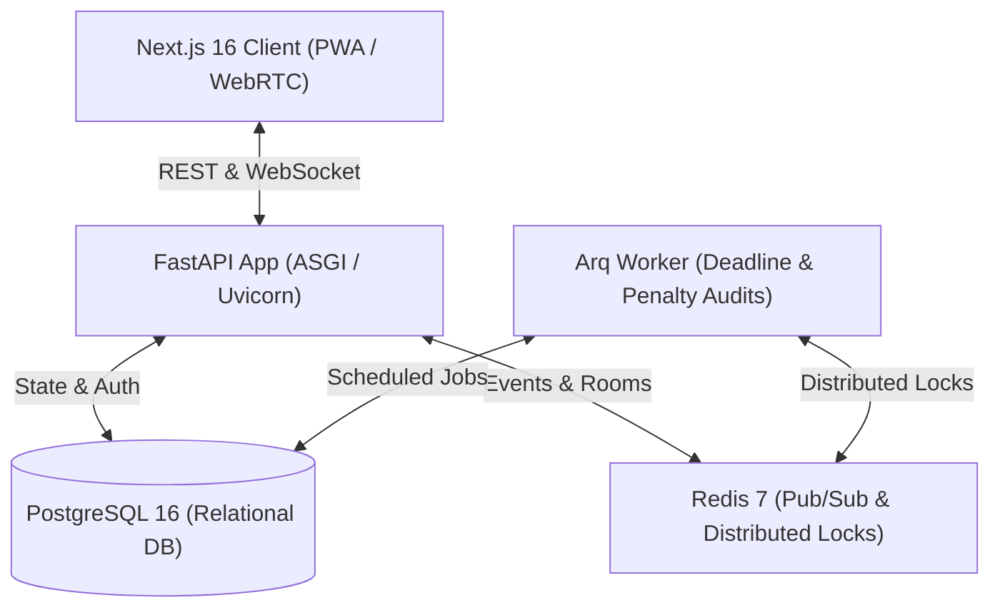

# Tribely — Social Accountability Micro-Arena Engine

Tribely is a high-concurrency social accountability platform that helps small peer groups build and sustain daily habits through financial commitments, peer audits, and real-time community engagement.

---

## 1. Core Architecture

Tribely is architected around a decoupled, layered micro-arena architecture designed for horizontal scalability and sub-second real-time synchronization:



- **Frontend**: Next.js 16 (App Router, Turbopack, React 19, TailwindCSS v4) with PWA support, WebRTC calling mesh, and optimistic UI caching.
- **Backend**: FastAPI (Python 3.11/3.12, async SQLAlchemy 2.0 ORM, Pydantic v2 schemas).
- **Real-Time Synchronization**: Bidirectional WebSocket connection pool backed by Redis Pub/Sub cluster adapters with instance-origin filtering to prevent message echoes.
- **Background Jobs**: Asynchronous Arq worker processing daily cutoff absence audits, automated penalty calculations, and ledger settlements.
- **Data & Storage**: PostgreSQL 16 relational database with double-entry bookkeeping ledger, and abstract storage adapter (`BaseStorageService`) supporting local disk storage and S3/CDN.

---

## 2. Project Directory Structure

```text
Tribely/
├── backend/                  # FastAPI Application & Background Workers
│   ├── app/
│   │   ├── api/              # HTTP & WebSocket route controllers
│   │   ├── core/             # Database, Redis, security, storage, verifiers
│   │   ├── models/           # SQLAlchemy 2.0 database models
│   │   ├── repositories/     # Data access layer (Repository Pattern)
│   │   ├── schemas/          # Pydantic v2 request/response schemas
│   │   ├── services/         # Business logic & domain services
│   │   └── workers/          # Arq background audit & notification workers
│   ├── migrations/           # Alembic database migration revisions
│   ├── scripts/              # Pre-deployment automated smoke tests
│   ├── static/uploads/       # Local media upload storage directory
│   ├── tests/                # Pytest unit & integration test suite
│   ├── Dockerfile            # Multi-stage production container build
│   ├── Dockerfile.backend    # Non-root container build for production
│   ├── main.py               # FastAPI application factory & router registration
│   └── requirements.txt      # Python dependencies
├── frontend/                 # Next.js 16 Web Application
│   ├── src/
│   │   ├── app/              # Next.js App Router pages & layouts
│   │   ├── components/       # Reusable UI components & modals
│   │   ├── lib/              # API client & fetch wrappers
│   │   └── services/         # Client-side authentication service
│   ├── public/               # Static assets & PWA manifest
│   ├── Dockerfile.frontend   # Standalone Next.js production container
│   └── package.json          # Node dependencies & build scripts
├── docker-compose.yml        # Development multi-container orchestration
├── docker-compose.prod.yml   # Production container orchestration
├── main.py                   # Root convenience launcher for backend
└── README.md                 # System overview and developer guide
```

---

## 3. Environment Variables

### Backend (`backend/.env`)

| Variable | Description | Default |
|:---|:---|:---|
| `POSTGRES_SERVER` | PostgreSQL host | `localhost` |
| `POSTGRES_PORT` | PostgreSQL port | `5432` |
| `POSTGRES_USER` | Database user | `postgres` |
| `POSTGRES_PASSWORD` | Database password | `postgres` |
| `POSTGRES_DB` | Database name | `tribely_db` |
| `REDIS_HOST` | Redis host | `localhost` |
| `REDIS_PORT` | Redis port | `6379` |
| `SECRET_KEY` | JWT signing secret key | *(Required in production)* |
| `ENVIRONMENT` | Runtime environment (`development` / `production`) | `development` |
| `STORAGE_PROVIDER` | Media storage provider (`local` / `s3`) | `local` |

### Frontend (`frontend/.env.local`)

| Variable | Description | Default |
|:---|:---|:---|
| `NEXT_PUBLIC_API_URL` | Backend REST API base URL | `http://localhost:8000` |
| `NEXT_PUBLIC_WS_URL` | Backend WebSocket base URL | `ws://localhost:8000` |

---

## 4. Quickstart & Running Locally

### Option A: Using Docker Compose (Recommended)

Start the entire stack (PostgreSQL, Redis, FastAPI backend, Arq audit worker, and Next.js frontend):

```bash
docker compose up --build
```

- Frontend: `http://localhost:3000`
- Backend API & Interactive Docs: `http://localhost:8000/docs`

---

### Option B: Running Services Manually

#### 1. Start Infrastructure
Ensure PostgreSQL is running on port `5432` and Redis is running on port `6379`.

#### 2. Backend Setup
```bash
cd backend
python -m venv venv
# Windows: venv\Scripts\activate | Unix: source venv/bin/activate
pip install -r requirements.txt

# Run database migrations
alembic upgrade head

# Start FastAPI API server
uvicorn main:app --host 0.0.0.0 --port 8000 --reload
```

To run the background audit worker (in a separate terminal):
```bash
cd backend
arq app.workers.audit_worker.WorkerSettings
```

#### 3. Frontend Setup
```bash
cd frontend
npm install
npm run dev
```

Visit `http://localhost:3000`.

---

## 5. Testing & Quality Assurance

### Run Backend Unit & Integration Tests
```bash
cd backend
python run_tests.py
```

### Run Pre-Deployment Automated Smoke Tests
Executes end-to-end user journeys (User registration, 1,000 welcome bonus verification, habit arena creation, deadline absence audit, penalty slash, and negative balance account freeze):

```bash
cd backend
python scripts/pre_deploy_smoke_test.py
```

### Run Frontend Production Build
```bash
cd frontend
npm run build
```
