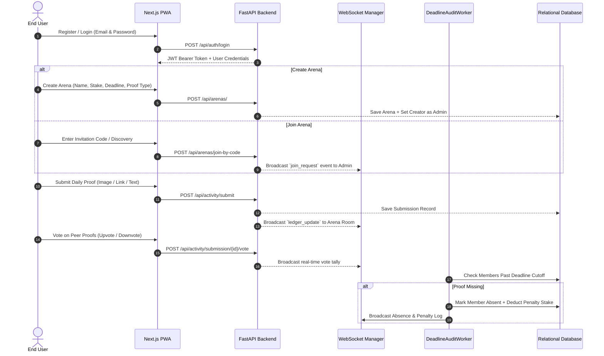

# 🗺️ Tribely: Complete End-User Workflow & System Execution Guide

**A Comprehensive Architectural & User Journey Training Blueprint for Gemini Pro / AI Assistants**

---

## 📖 Executive Summary & Core Philosophy

**Tribely** is a high-accountability, skin-in-the-game habit enforcement platform structured around micro-arena chambers. Unlike traditional habit trackers that rely on passive self-reporting, Tribely enforces daily discipline using **3 core pillars**:
1. **Financial Stakes & Local Penalties**: Monetary stakes (e.g. ₹500) backed by automated audit enforcement.
2. **Peer Consensus Verification**: Members must upload verifiable proof (Image, URL, or Text) which is audited by arena peers.
3. **Deterministic Daily Cutoff Deadlines**: Hard daily cutoff deadlines (e.g. 10:00 PM) enforced by background automated cron audit workers.

---

## 🔄 Complete End-to-End User Journey Workflow

---

## 📑 Detailed Stage-by-Stage Breakdown

### Stage 1: Registration, Authentication & Profile Setup
1. **Account Creation (`/register`)**:
   - User inputs `Full Name`, `Email Address`, and `Password`.
   - Backend hashes password via **Bcrypt** and generates user record in `users` table.
2. **Authentication (`/login`)**:
   - User authenticates with credentials.
   - Backend responds with a signed **JWT Access Token**.
   - Token is stored locally (`tribely_token`, `tribely_user_id`, `tribely_user_name`) and attached as Bearer Token in Axios API headers.
3. **Profile Customization (`/profile`)**:
   - User can upload a custom profile DP picture, view active streak counters, total penalties paid, and total proofs submitted.

---

### Stage 2: Dashboard & WhatsApp-Style Arena Discovery
1. **Dashboard Home (`/dashboard`)**:
   - Displays all accountability arenas joined or created by the user.
2. **WhatsApp-Style Dynamic Activity Ranking**:
   - Arenas do NOT render in static order; they are **dynamically sorted by `last_activity_at` descending**.
   - Whichever arena has the most recent chat message or daily proof submission automatically moves to **Position #1 at the top of the list**.
   - Each card displays a WhatsApp-style DP Avatar with an emerald ring border, live activity preview snippet (e.g. `💬 Mayur: Done for today!` or `📸 Mayur posted daily proof`), and relative time badge (`Just now`, `2m ago`, `Yesterday`).
3. **Joining Arenas**:
   - **Public Discovery**: Browse public accountability chambers.
   - **Join via Code**: Enter a 6-character invitation key (e.g. `FXC2V1`). Private arenas place the join request in `"pending"` status until approved by the Admin.

---

### Stage 3: Arena Creation & Group Administration
1. **Creating a Micro-Arena**:
   - Admin configures:
     - **Arena Name & Description** (e.g., *"Leetcode Daily"* / *"Daily 1 Problem"*).
     - **Required Verification Rule**: `Text Only` (✍️), `Link (URL)` (🔗), or `Image Upload` (📸).
     - **Daily Cutoff Deadline**: Deterministic 12-hour format string set via an interactive clock timer (e.g. `10:00 PM`, `05:00 AM`, `11:59 PM`).
     - **Penalty Stake Amount**: Monetary stake (e.g., ₹500) incurred upon missing a deadline.
     - **Privacy**: Public or Private.
2. **Master WhatsApp Group Profile Drawer (`/arena/[id]`)**:
   - Clicking the arena header or `👥 Group Info` opens a master side-drawer featuring:
     - **Group DP Avatar**: Editable by Group Admin (`📷 Edit DP`).
     - **ℹ️ About Arena Card**: Displays room purpose/rules with an inline editor (`✏️ Edit About`) for Admins.
     - **👑 Admin Settings & Control**: Includes `CustomSelect` proof type picker and interactive `DeadlineTimerSetter` clock component. Updating settings sends `PATCH /api/admin/arenas/{id}/settings` and broadcasts `arena_settings_updated` over WebSockets to update all members' screens without refreshing.
     - **Pending Join Approvals**: Admit or deny requested access.
     - **Member List & Tags**: Displays member badges (`👑 Group Admin`, `Member`).
     - **Admin Kick Authority**: Admins can tap `🚫 Remove` next to non-admin members. This executes `POST /api/admin/arenas/remove`, broadcasts `member_removed` over WebSockets, and immediately redirects the kicked user to `/dashboard` without a page refresh.

---

### Stage 4: Daily Habit Loop & Proof Submission
1. **Entering the Arena Room (`/arena/[id]`)**:
   - Shows live daily countdown timer counting down to the exact cutoff deadline.
   - Displays current active proof requirement badge.
2. **Submitting Proof**:
   - User inputs text, URL link, or uploads an image file.
   - Submitting sends `POST /api/activity/submit`.
   - Backend calculates the 24-hour active window ending at `deadline_time`. If user already submitted in the current window, prevents duplicate submission.
   - Submission is recorded in `submissions` table and broadcasted live to the arena room over WebSockets.

---

### Stage 5: Peer Verification & Consensus Voting
1. **Live Proof Feed & Ledger**:
   - Members can view all submitted proof cards for the active daily window.
   - Image uploads feature full-screen zoom inspection lightbox.
2. **Consensus Voting**:
   - Arena peers evaluate proof validity by clicking **Upvote** (👍) or **Downvote** (👎).
   - Executes `POST /api/activity/submission/{id}/vote`.
   - Real-time WebSocket updates update vote counts and verification status instantly.
3. **Live Group Chat**:
   - Built-in chat channel for daily motivation, text messages, and emoji reactions.

---

### Stage 6: Automated Background Audits & Penalty Execution
1. **`DeadlineAuditWorker` Background Cron**:
   - An automated background engine checks all active arenas across deadline cutoff times.
2. **Audit Execution**:
   - For every approved member in an arena, checks if a valid submission exists for the cutoff window.
   - **If Submission Exists**: Member is marked compliant; streak counter increments.
   - **If Missing (Cutoff Passed)**:
     - Generates an `absent` record in `submissions` / `daily_arena_sheets`.
     - Deducts the configured **Penalty Stake Amount** (e.g. ₹500) and logs a financial penalty transaction in `audit_logs`.
     - Resets the member's daily active streak to 0.
     - Broadcasts real-time absence notification over WebSockets.

---

## 🛠️ System API Endpoint Quick Reference

| Endpoint | Method | Role | Description |
| :--- | :--- | :--- | :--- |
| `/api/auth/register` | `POST` | Public | Registers a new user account. |
| `/api/auth/login` | `POST` | Public | Authenticates credentials & issues JWT token. |
| `/api/arenas/` | `GET` | User | Fetches user's arenas sorted by recent activity (`last_activity_at` DESC). |
| `/api/arenas/` | `POST` | User | Creates a new micro-arena chamber. |
| `/api/arenas/join-by-code` | `POST` | User | Joins an arena using invite code. |
| `/api/arenas/{id}/members` | `GET` | User | Fetches arena room members. |
| `/api/activity/submit` | `POST` | User | Submits daily verification proof (Text/Link/Image). |
| `/api/activity/submission/{id}/vote`| `POST` | User | Casts upvote/downvote consensus vote. |
| `/api/activity/arena/{id}/message` | `POST` | User | Sends group chat message. |
| `/api/admin/arenas/{id}/settings` | `PATCH` | Admin | Updates arena settings (deadline, proof type, about, DP). |
| `/api/admin/arenas/remove` | `POST` | Admin | Kicks a member from the arena. |
| `/api/admin/arenas/{id}` | `DELETE`| Admin | Permanently deletes an arena. |
| `/ws/arena/{id}` | `WS` | All | Bi-directional WebSocket tunnel for real-time sync. |

---

*This guide serves as a complete functional and technical blueprint to train Gemini Pro or any personal AI assistant on the Tribely project roadmap.*
