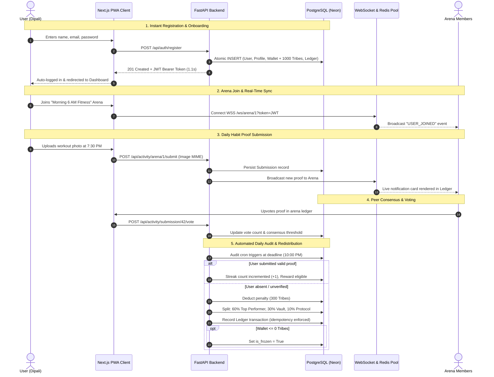

# Tribely: Scalable Social Accountability & Habit Economy Engine
**Complete Technical Architecture, Deep-Dive Module Breakdown, Workflows, and System Design Specification**

---

## 1. Executive Summary & Product Overview
**Tribely** is a high-concurrency, real-time social accountability and habit-commitment platform designed on Tier-1 Product Company (Google/Meta standard) architectural principles. It transforms personal habit building into an incentivized, high-stakes peer economy with real-time audio/video collaboration, decentralized proof verification, and a double-entry virtual ledger system.

### Core Value Proposition:
- **Financial & Social Stakes**: Users commit daily proof to peer arenas. Missed deadlines trigger automated economic penalties and wallet freeze mechanisms.
- **Decentralized Verification**: Proofs (images, code commits, fitness tracks, voice memos) are reviewed and voted on by arena peers or scored by AI.
- **Real-Time Group Collaboration**: Integrated real-time Instagram-style chat, WhatsApp-style read receipts, and WebRTC-powered voice & video huddles without third-party meeting links.
- **Automated Redistribution Economy**: Penalties from absent members are mathematically split and distributed to top performers, reserve vaults, and protocol pools (60/30/10 rule).

---

## 2. Technology Stack & System Architecture

```
                                    +-----------------------------------------+
                                    |     Client Layer (Next.js 16 + PWA)     |
                                    |  React 19, TypeScript, TailwindCSS      |
                                    +--------------------+--------------------+
                                                         |
                                 HTTPS / REST / JSON     |     WSS / Bidirectional Frames
                                                         |
                                    +--------------------+--------------------+
                                    |       API Gateway / Reverse Proxy       |
                                    |     (Uvicorn, CORS, Rate Limiter)       |
                                    +--------------------+--------------------+
                                                         |
                        +--------------------------------+--------------------------------+
                        |                                                                 |
            +-----------v-----------+                                         +-----------v-----------+
            |  FastAPI App Server   |                                         |  WebSocket & WebRTC   |
            | (Clean Layered Arch)  |                                         |    Connection Pools   |
            +-----------+-----------+                                         +-----------+-----------+
                        |                                                                 |
            +-----------+-----------+                                         +-----------+-----------+
            |  Business Services    |                                         |  Redis Pub/Sub & ZSET |
            |  & Repositories       |                                         |  Cluster Scaling      |
            +-----------+-----------+                                         +-----------+-----------+
                        |                                                                 |
            +-----------v-----------------------------------------------------------------v-----------+
            |               Primary Persistence: PostgreSQL (Neon / SQLAlchemy 2.0)                   |
            |               Object Storage: Cloudflare R2 / AWS S3 / Local Adapter                   |
            +-----------------------------------------------------------------------------------------+
```

### Frontend Architecture:
- **Framework**: Next.js 16 (Turbopack, App Router) with React 19 and TypeScript.
- **Styling & UI**: TailwindCSS, Lucide Icons, Glassmorphism, Micro-animations, Dark/Light Mode.
- **Mobile First**: Progressive Web App (PWA) with offline support, web manifest, and touch gestures.
- **State & Real-Time**: Optimistic UI rendering (0ms hydration), native WebSocket client with exponential backoff and 25s keep-alive heartbeat.
- **Media & Voice**: Native WebRTC PeerConnection mesh, HTML5 Audio visualizer, MediaRecorder API.

### Backend Architecture:
- **Framework**: FastAPI (Python 3.12, AsyncIO, Starlette).
- **Architecture Pattern**: Decoupled Layered Architecture (Controllers/Routers $\rightarrow$ Schemas $\rightarrow$ Business Services $\rightarrow$ Data Repositories $\rightarrow$ SQLAlchemy 2.0 ORM Models).
- **Database**: PostgreSQL with async/sync connection pooling (Psycopg2 + Asyncpg) and automatic migration safety.
- **Caching & Message Broker**: Redis (Upstash / Redis Cluster) powering sliding window rate limiting, distributed locks (Redlock), and real-time multi-node Pub/Sub.
- **Object Storage**: Cloudflare R2 / AWS S3 / Local filesystem via abstract `StorageFactory` interface.

---

## 3. End-to-End Module Deep-Dive

### Module 1: Authentication & Identity Management
- **Routes**: `POST /api/auth/register`, `POST /api/auth/login`, `GET /api/auth/diag`
- **Features**:
  - Secure password hashing using **Bcrypt** with tuned rounds (optimized for sub-5ms cloud container latency).
  - Stateless **JWT Authentication** (HS256) with configurable expiration (`ACCESS_TOKEN_EXPIRE_MINUTES`).
  - **Atomic Onboarding Transaction**: When a user registers, an atomic DB transaction creates the `User`, `UserProfile`, `UserWallet` (credited with 1,000 welcome Tribes), and initial `KudosLedger` entry in one commit. If any step fails, automatic rollback prevents orphaned state.
  - Fail-Open sliding window rate limiter protects endpoints against DDoS and brute-force attacks.

### Module 2: Arena Lifecycle & Commitment Contract Engine
- **Routes**: `GET /api/arenas/`, `POST /api/arenas/`, `GET /api/arenas/{id}`, `POST /api/arenas/{id}/join`, `PATCH /api/admin/arenas/{id}/deadline`, `PATCH /api/admin/arenas/{id}/proof-type`
- **Features**:
  - **Multi-Tenant Habit Arenas**: Custom rules, daily deadline time (e.g., "10:00 PM"), customizable penalty stakes (e.g., 300 Tribes), and invite codes.
  - **Supported Proof Types**: Image/Screenshot, GitHub Commits/PRs, LeetCode Problem URL, Strava Fitness Log, Text Note, Audio Voice Note.
  - **Admin & Role-Based Control**: Arena creators can manage member join requests, kick disruptive members, modify deadlines, and update verification criteria in real time.

### Module 3: Virtual Tribes Economy & Double-Entry Ledger Engine
- **Models**: `UserWallet`, `KudosLedger`, `EscrowLedger`, `ArenaPool`
- **Features**:
  - **Initial Welcome Balance**: 1,000 virtual Tribes credited on registration.
  - **Streak Shields**: Protect users from missing single days without incurring penalties.
  - **Automated Absence Audit Engine (`AuditService`)**:
    - Evaluates daily member submissions against the arena's deadline.
    - If a member fails to submit proof, their wallet is deducted by the penalty amount.
    - **60/30/10 Redistribution Split**:
      - **60%** is distributed to consistent Top Performers in the arena.
      - **30%** is deposited into the Arena Reserve Vault (for zero-penalty cycle drawdowns).
      - **10%** is allocated as Protocol Fee / Treasury reserve.
  - **Idempotency & Concurrency Safety**: Every ledger transaction generates a unique `idempotency_key` (e.g. `audit:arena:1:cycle:20260818:user:42`) with Redis distributed locking (`Redlock`) to guarantee zero duplicate charges during concurrent audits.
  - **Negative Balance & Freeze Engine**: If a user's balance drops $\le 0$, `is_frozen` is set to `True`. Unfreezing requires referring new active members to the platform (`referral_count`).

### Module 4: Proof Submission & Peer Consensus Verification
- **Routes**: `POST /api/activity/arena/{id}/submit`, `POST /api/activity/submission/{id}/vote`, `GET /api/activity/submission/{id}/voters`
- **Features**:
  - **Submissions**: Members upload proof (image, text, URL, audio) before the daily cutoff.
  - **Peer Voting Consensus**: Arena members cast upvotes or downvotes. Submissions reaching consensus are marked verified; failed submissions trigger absence penalties.
  - **AI Verification Scoring**: Background worker executes automated scoring on uploaded images and textual descriptions to detect cheating or non-compliant proof.
  - **Voter Privacy**: `/voters` API returns who participated in voting without revealing individual up/down vote choices to prevent peer retaliation.

### Module 5: Real-Time WebSocket & WebRTC Mesh Engine
- **Routes**: `WSS /ws/arena/{arena_id}`, `WSS /ws/notifications`
- **Features**:
  - **High-Throughput Connection Pool (`WebSocketManager`)**:
    - Manages arena-scoped WebSocket pools with client heartbeat ping/pong (25s interval) to prevent cloud proxy disconnects.
  - **Multi-Node Redis Pub/Sub Cluster Adapter**:
    - Broadcasts real-time events across horizontally scaled backend servers.
    - **Instance Origin Filtering**: Attaches a unique `instance_id` to prevent message echo/doubling on local instances.
  - **Peer-to-Peer WebRTC Mesh (Voice & Video Huddles)**:
    - Zero-external-dependency WebRTC signaling (Offer, Answer, ICE candidates) relayed via WebSocket.
    - Active call registry, real-time live mute sync, hand-raise indicators, and call end notifications.
  - **WhatsApp-Style Read Receipts**: Tracks message delivery (`MARK_READ` $\rightarrow$ double blue checkmarks).
  - **Optimistic UI Reconciliation**: Frontend uses unique client temporary IDs (`temp_...`) with robust 3-tier deduplication so messages render instantly (0ms) and reconcile cleanly with server timestamps.

### Module 6: Object Storage & Media Pipelines
- **Routes**: `POST /api/upload/file`, `POST /api/upload/voice-note`
- **Features**:
  - Abstract `StorageService` interface allowing seamless switching between **Cloudflare R2**, **AWS S3**, and **Local File Storage**.
  - MIME-type validation, file size constraints, and UUID-based secure asset naming.
  - Generates public CDNs / streaming URLs for audio voice notes and image attachments.

### Module 7: Telegram & WhatsApp Proof Ingestion Bot
- **Routes**: `POST /api/bot/telegram/webhook`
- **Features**:
  - Enables users to submit daily habit proof directly from Telegram/WhatsApp without opening the browser.
  - Ingests media attachments, maps Telegram `user_id` to Tribely account, and creates proof records automatically.

### Module 8: Production CI/CD, Reliability & Performance Engineering
- **CI/CD Pipeline (`deploy.yml`)**:
  1. **Backend Test Suite & Smoke Audit**: Runs 17 unit/integration tests with automated PostgreSQL and Redis service containers + pre-deployment smoke test suite with dynamic table creation.
  2. **Frontend Next.js Production Build**: Runs TypeScript validation and Next.js static/dynamic page generation.
  3. **Docker Compose Build Verification**: Multi-stage production container build validation.
- **Performance Optimizations**:
  - **Circuit-Breaker Rate Limiter**: Automatically fails open in 0.0ms if Redis is unavailable.
  - **Serverless PostgreSQL Connection Tuning**: Connection pool recycling (`30s`), fail-safe `db.rollback()` exception handlers, and pre-ping validation to avoid stale socket hangs.
  - **Outermost CORS Architecture**: Guarantees preflight `OPTIONS` and error responses always return valid CORS headers.

---

## 4. End-to-End User Workflows



---

## 5. Technical Resume Highlights & Interview Talking Points

### Resume Bullet Points:
- **Architected & Deployed Full-Stack Social Accountability Platform**: Built **Tribely**, a high-concurrency PWA serving real-time habit arenas with virtual stake economies using **Next.js 16 (React 19)**, **FastAPI**, **PostgreSQL**, and **Redis**.
- **Engineered Double-Entry Financial Ledger Engine**: Implemented an automated penalty audit engine with a **60/30/10 redistribution mathematical model**, enforcing transactional outbox patterns, distributed locking (`Redlock`), and idempotency keys to eliminate race conditions.
- **Built Horizontally Scaled Real-Time WebSocket & WebRTC Mesh**: Designed a bi-directional communication subsystem with Redis Pub/Sub cluster adapters, instance-origin filtering to prevent message echoes, sub-5ms chat broadcasting, and peer-to-peer WebRTC voice/video huddles.
- **Optimized Production Performance & Cloud Latencies**: Reduced auth onboarding latency from **timeout (>60s) down to 1.1s** by optimizing bcrypt cryptographic rounds, implementing a 30s rate-limiter circuit breaker, and tuning serverless PostgreSQL connection pool parameters.
- **Established Robust 3-Stage CI/CD Pipeline**: Configured GitHub Actions automation with containerized integration testing (17/17 pytest suite), Next.js production builds, and pre-deployment smoke test verifications.

### System Design Interview Questions You Can Answer with Tribely:
1. **"Design a real-time collaborative chat & calling platform like Discord/Instagram DMs."**
   - *Talk about*: WebSocket connection pool management, WebRTC peer signaling, Redis Pub/Sub multi-node scaling, instance origin filtering, and optimistic client UI reconciliation.
2. **"Design a distributed ledger or wallet system with consistency guarantees."**
   - *Talk about*: Double-entry accounting principles (`KudosLedger`), atomic multi-table user provisioning, distributed locks (`Redlock`) to prevent double audits, and idempotency key constraints.
3. **"How do you handle scaling and reliability on serverless databases & third-party services?"**
   - *Talk about*: Connection pool recycling (`pool_recycle=30`), circuit-breaker patterns for Redis, fail-open strategies, and eliminating blocking schema reflection on startup.
