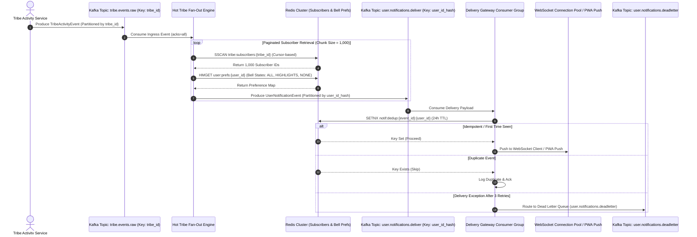

# Tribely Distributed Kafka Notification Engine Architecture

**Role:** Principal Distributed Systems Architect  
**Platform:** Tribely Habit Arenas & Tribe Channel Platform  
**Pattern:** Decoupled Event-Driven Channel Fan-Out Engine (YouTube / Instagram Scale)

---

## 1. End-to-End Architecture & Sequence Diagram



---

## 2. Kafka Topic Topology & Keying Strategy

| Topic Name | Partition Key | Partition Count | Replication Factor | Retention Period | Cleanup Policy | Purpose |
| :--- | :--- | :--- | :--- | :--- | :--- | :--- |
| `tribe.events.raw` | `tribe_id` | **32** | **3** | 7 Days | `delete` | Ingress event stream ordered per Tribe channel |
| `user.notifications.deliver` | `user_id_hash` | **128** | **3** | 3 Days | `delete` | High-throughput fanned-out notification queue |
| `user.notifications.deadletter` | `user_id_hash` | **16** | **3** | 14 Days | `delete` | Dead-letter queue for failed deliveries |

### Keying Strategy & Partition Balancing
1. **`tribe.events.raw` (Key = `tribe_id`)**: Guarantees total ordering of events published within a single Tribe.
2. **`user.notifications.deliver` (Key = `user_id_hash`)**: Consistent MD5 hash of `user_id` modulo 128 partitions. Prevents partition hotspotting when a "Hot Tribe" with millions of subscribers fans out.

---

## 3. Hot Tribe Fan-Out Architecture (Million-Subscriber Scale)

### The Hot Tribe Problem & Solutions
- **Problem**: When a Tribe with 2,000,000 subscribers posts a live stream, emitting a single 2M-user array payload causes payload size explosion and head-of-line blocking.
- **Solution 1: Non-Blocking Cursor-Based Chunking (`SSCAN`)**: The Fan-Out Engine fetches subscribers in batches of 1,000 using Redis `SSCAN`.
- **Solution 2: Partition Hotspot Prevention**: Instead of keying fanned-out messages by `tribe_id`, messages are re-keyed by `user_id_hash` and distributed across 128 partitions.
- **Solution 3: In-Memory Preference Filtering**: Muted subscribers (`NONE` bell state) are filtered out instantly in memory before generating egress Kafka records.

---

## 4. Formal Event Contracts (JSON Schemas)

### Ingress Event Schema (`tribe.events.raw`)
```json
{
  "event_id": "c8f1e2a0-4567-4321-89ab-cdef01234567",
  "tribe_id": 4,
  "actor_id": 101,
  "event_type": "POST_CREATED",
  "timestamp": "2026-08-09T15:32:00.000000Z",
  "priority": "HIGH",
  "metadata": {
    "title": "🎉 Daily Verification Challenge",
    "body": "Mayur posted a new LeetCode proof in LeetCode Arena!",
    "target_url": "/arena/4"
  }
}
```

### Egress Delivery Schema (`user.notifications.deliver`)
```json
{
  "notification_id": "a91b2c3d-1111-2222-3333-444455556666",
  "event_id": "c8f1e2a0-4567-4321-89ab-cdef01234567",
  "user_id": 1002,
  "tribe_id": 4,
  "event_type": "POST_CREATED",
  "user_preference_bell": "ALL",
  "delivery_channel": "WEBSOCKET",
  "payload": {
    "title": "🎉 Daily Verification Challenge",
    "body": "Mayur posted a new LeetCode proof in LeetCode Arena!",
    "target_url": "/arena/4"
  },
  "created_at": "2026-08-09T15:32:00.123456Z"
}
```

---

## 5. Resilience, State Management & Guarantees

1. **At-Least-Once Delivery & Deduplication**:
   - Consumers execute `SETNX notif:dedup:{event_id}:{user_id} 1 EX 86400` in Redis.
   - If the key exists, the message is skipped immediately, providing end-to-end idempotency.
2. **Preference Filtering Layer**:
   - Redis hash maps (`user:prefs:{user_id}`) store notification bell preferences (`ALL`, `HIGHLIGHTS`, `NONE`).
3. **Dead Letter Queue (DLQ)**:
   - Poison pill messages or delivery failures after 3 exponential backoff retries are written to `user.notifications.deadletter` for manual inspection.

---

## 6. Edge Cases & Mitigation Strategies

| Edge Case | Root Cause | Architectural Mitigation |
| :--- | :--- | :--- |
| **Network Partition / Broker Outage** | Kafka cluster temporary loss | Producer falls back seamlessly to local Redis Pub/Sub ring & disk log |
| **Slow Consumer Lag** | FCM Push API latency spike | Asynchronous worker pools process partitions in parallel with 128 partitions |
| **Duplicate Events** | Kafka producer re-transmits on retry | Atomic `SETNX` deduplication keys in Redis (24h TTL) |
| **Mass Subscription Spike** | Celebrities joining platform | Cursor-based chunking (`SSCAN`) limits chunk size to 1,000 subscribers per message |
