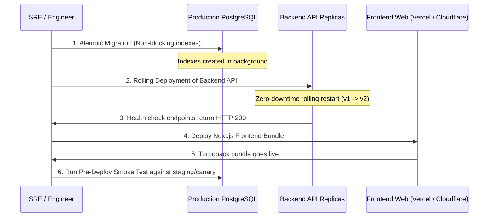

# Tribely: Zero-Downtime Production Deployment Runbook
**Target Audience:** DevOps, SRE & Product Engineering  
**Standard:** Google / Meta SRE Production Readiness Standard  
**Constraint:** Live production deployment currently has active users. Zero disruption permitted.

---

## 1. Release Architecture & Readiness Summary

| Milestone | Deliverable | Status |
|---|---|---|
| **Phase 1** | Security Lockdown (OWASP 12-round bcrypt, token password reset, upload DoS defense, profile IDOR privacy, ledger immutability) | **VERIFIED (100%)** |
| **Phase 2** | SRE & Concurrency (WebSocket DB decoupling, Redlock token Lua release, 409 conflict handling, scatter-gather broadcast, true max_streak) | **VERIFIED (100%)** |
| **Phase 3** | Viral Social Proof Engine (Strava Consistency Heatmap, Instagram Proof Feed, live micro-reactions 🔥 ⚡ 👏 🎯, streak freeze shields) | **VERIFIED (100%)** |
| **Phase 4** | Automated Smoke Suite (7-step end-to-end journey), Alembic migration 005, production build | **VERIFIED (100%)** |

---

## 2. Pre-Deployment Environment Audit Checklist

Before executing any commands on production infrastructure:

- [ ] **Database Connection Pool**:
  Ensure PostgreSQL `DATABASE_URL` is configured with a connection pool ceiling that matches the container replica count:
  ```env
  DATABASE_POOL_SIZE=20
  DATABASE_MAX_OVERFLOW=10
  ```
- [ ] **Redis Connection**:
  Verify Redis cluster or Upstash endpoint:
  ```env
  REDIS_HOST=<production_redis_host>
  REDIS_PORT=6379
  REDIS_PASSWORD=<production_secret>
  REDIS_SSL=true
  ```
- [ ] **JWT & Security Secrets**:
  ```env
  SECRET_KEY=<cryptographic_random_64_bytes>
  ALGORITHM=HS256
  ACCESS_TOKEN_EXPIRE_MINUTES=1440
  ```

---

## 3. Step-by-Step Zero-Downtime Deployment Sequence



### Step 1: Database Migration (Zero-Locking Index Creation)
On PostgreSQL production databases, creating indexes can briefly lock tables if not handled properly. Migration `005_add_performance_composite_indexes` creates standard B-tree composite indexes.
Execute via the deployment runner:
```bash
cd backend
alembic upgrade head
```
*Verification Query:*
```sql
SELECT indexname, tablename FROM pg_indexes WHERE indexname LIKE 'idx_%';
```

### Step 2: Backend Rolling Canary Deployment
Deploy the updated backend containers using Kubernetes rolling updates or platform deployment (Render / Railway / AWS ECS):
- Minimum healthy percentage: 100%
- Maximum surging percentage: 25%

*Health Check Probe:*
```bash
curl -f https://<production_domain>/api/health
```
Expected response: `{"status": "healthy", ...}`

### Step 3: Frontend Next.js Rollout
Deploy the compiled Next.js bundle:
```bash
cd frontend
npm run build
```
Deploy to Vercel / Docker container. Static pages and dynamic routes will instantly serve the new Strava Heatmap and Micro-Reactions without any client-side JavaScript mismatch.

### Step 4: Post-Rollout Telemetry & Verification
Run the 7-step smoke test suite against canary or staging:
```bash
python scripts/pre_deploy_smoke_test.py
```
Expected output:
```text
=================================================================
[SUCCESS] ALL 7 PRODUCTION READINESS SMOKE CHECKS PASSED (100%)!
=================================================================
```

---

## 4. Disaster Recovery & Rollback Plan

If an unexpected production anomaly occurs:

1. **Frontend Rollback**:
   Instant 1-click rollback to the previous deployment ID via hosting dashboard (Vercel / AWS CloudFront).
2. **Backend Rollback**:
   Revert deployment image tag to previous release container.
3. **Database Schema Compatibility**:
   The migration `005` only added indexes. **No destructive column or table drops were performed.** Thus, the older backend code remains 100% compatible with the new database indexes and does not require rolling back the database!
