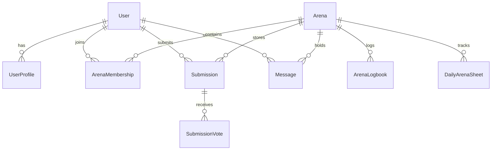

# Tribely Project Architecture, System Design & File Audit

## Executive Summary
**Tribely** is a social accountability micro-arena web application that allows users to form habit "arenas", stake penalties, submit daily habit proofs (with AI verification capabilities), engage in real-time arena huddle chats via WebSockets, track streaks, and view financial escrow pool summaries.

---

## 1. System & Technology Stack Overview

### Backend Architecture
- **Framework**: FastAPI (Python 3.12)
- **Database ORM**: SQLAlchemy 2.0 (Relational ORM targeting PostgreSQL/SQLite)
- **Data Validation & Schemas**: Pydantic v2
- **Realtime Infrastructure**: Native WebSockets managed via `WebSocketManager` singleton
- **File Storage Abstraction**: Strategy pattern supporting AWS S3 and Local File Storage (`StorageFactory`)
- **Security & Auth**: OAuth2 Password Bearer with JWT tokens (`python-jose`), bcrypt password hashing (`passlib`)

### Frontend Architecture
- **Framework**: Next.js 15+ (App Router) with TypeScript & React 19
- **Styling**: Tailwind CSS combined with Custom CSS variables (`var(--bg)`, `var(--fg)`) supporting Light/Dark themes
- **Client Cache**: Custom SWR-like data caching layer (`dataCache.ts`) with prefetching support (`FastLink.tsx`)
- **HTTP Client**: Dual-stack (Axios in `src/app/utils/api.ts` and custom `apiClient` wrapper in `src/lib/api-client.ts`)

---

## 2. Complete Feature Matrix

| Feature Module | Component / Endpoint | Description |
| :--- | :--- | :--- |
| **Authentication & Auth** | `/api/auth/register`, `/api/auth/login` | User signup, password hashing, JWT token issuance, authenticated route guards. |
| **User Profile Management** | `/users/profile/*` | Profile picture updates, password changing, profile deletion, profile retrieval. |
| **Arena Management** | `/api/arenas/*` | Create habit arenas, list public discovery arenas, join by invite code, member listing, leave arena. |
| **Admin Arena Panel** | `/api/admin/arenas/*` | Creator controls to approve/reject join requests, transfer ownership, manage arena settings. |
| **Proof Submission & Audit**| `/api/activity/submit`, `/api/activity/submission/*/vote` | Daily habit proof photo/video submission, community upvote/downvote audit, automated AI verifier pass-through. |
| **Realtime Huddle Chat** | `/api/activity/arena/*/chat`, WS `/ws/arena/{id}` | Live arena chat room with WebSocket broadcasting and HTTP historical message persistence. |
| **Streak Tracking** | `/api/streak/*` | Calculates daily active habit streaks, consistency percentages, and active streak counts per arena. |
| **Escrow & Penalty Pool** | `/api/escrow/*` | Financial penalty pool accounting, total pool calculation based on missed deadline sheets. |
| **Theme & Dark Mode** | `ThemeContext.tsx` | Global theme context switching between dark/light mode with CSS variables. |
| **Security & Protocol Pages**| `/security`, `/protocol`, `/transparency`, `/support` | Informational legal, protocol transparency, and user support pages. |

---

## 3. Database Schema & Data Modeling

- **Users (`users`)**: Core account credential store.
- **UserProfiles (`user_profiles`)**: User avatar and metadata storage.
- **Arenas (`arenas`)**: Habit group details (proof type, deadline time, penalty amount, invite codes).
- **ArenaMemberships (`arena_memberships`)**: User role (`creator`, `member`) and approval status (`approved`, `pending`).
- **Submissions (`submissions`)**: Daily proof links, upvote/downvote tallies, verification status, absence markers.
- **SubmissionVotes (`submission_votes`)**: Unique user vote ledger per submission.
- **Messages (`messages`)**: Chat history persistence log for WebSocket and REST endpoints.
- **DailyArenaSheets (`daily_arena_sheets`)**: Daily member attendance and proof fulfillment ledger.
- **ArenaLogbooks (`arena_logbook`)**: Audit trail for penalties assessed and financial transactions.

---

## 4. Evaluation of OOP & System Design Principles

### A. SOLID Principles Analysis
1. **Single Responsibility Principle (SRP)**:
   - **Backend Services**: High adherence in `auth_service.py`, `streak_service.py`, and `escrow_service.py`. Each encapsulates a single domain concern.
   - **Frontend UI**: Moderate-to-low adherence in `src/app/arena/[id]/page.tsx` (over 105 KB in a single file combining chat UI, voting, proof modals, websocket subscriptions, and state).
2. **Open/Closed Principle (OCP)**:
   - High adherence in **Storage Layer** (`base_storage.py`, `local_storage.py`, `s3_storage.py`). New storage providers can be added without modifying existing consumer code.
3. **Liskov Substitution Principle (LSP)**:
   - Correctly maintained in Storage drivers and Repositories (`BaseRepository` subclassed by `UserRepository`, `ArenaRepository`, `ActivityRepository`).
4. **Interface Segregation Principle (ISP)**:
   - Repository interfaces (`base.py`) define specific generic methods (`get`, `create`, `update`, `delete`).
5. **Dependency Inversion Principle (DIP)**:
   - High adherence in services consuming generic storage abstractions and repositories.
   - Violation in `api/activity.py` line 13 and `api/deps.py` line 9, which import procedural CRUD functions directly instead of relying on repository abstractions.

### B. Object-Oriented Design Patterns & Architectural Smells
- **Design Patterns Successfully Applied**:
  - **Strategy Pattern**: `StorageFactory` selects `LocalStorage` or `S3Storage` based on configuration.
  - **Repository Pattern**: Abstracted database access in `repositories/`.
  - **Singleton Pattern**: WebSocket connection pool (`WebSocketManager`) and Domain Event Publisher (`DomainEventPublisher`).
  - **Domain Event Pattern**: In-memory event dispatcher (`domain_events.py`) firing events on proof submissions.
- **Architectural Anti-Patterns & Code Smells**:
  - **Dual HTTP Client Abstractions (Frontend)**: `src/app/utils/api.ts` (Axios instance) operates alongside `src/lib/api-client.ts` (`ApiClient` wrapper), leading to duplicate interceptor logic and mixed API call mechanisms across pages.
  - **Procedural Leakage (Backend)**: Bypassing the Repository pattern in `activity.py` and `deps.py` by referencing legacy procedural CRUD helpers (`crud_activity`, `crud_user`).
  - **Broken Unused Classes**: `PenaltyStake` value object in `value_objects.py` missing `self` in method signature (`def format_currency()`).
  - **Broken Model References in Unused Workers**: `deadline_audit_task.py` instantiates `ArenaLogbook` with non-existent keyword arguments (`event_type`, `details`) and misses `Optional` type import.

---

## 5. Audit of Unneeded & Redundant Files

> [!NOTE]
> Per request instructions, root markdown (`.md`) files are excluded from this list.

| File Path | Category | Status | Reason Why Not Needed / Redundant | Action / Recommendation |
| :--- | :--- | :--- | :--- | :--- |
| [crud_arena.py](file:///c:/Users/mayur/Downloads/Tribely-main/backend/app/crud/crud_arena.py) | Backend CRUD | **Unused / Dead** | Zero imports across backend. Replaced by `ArenaRepository` and `ArenaService`. | **Delete** |
| [rate_limiter.py (tasks)](file:///c:/Users/mayur/Downloads/Tribely-main/backend/app/core/tasks/rate_limiter.py) | Backend Core | **Unused / Duplicate** | Duplicate of `backend/app/core/rate_limiter.py`. Never imported anywhere. | **Delete** |
| [deadline_audit_task.py](file:///c:/Users/mayur/Downloads/Tribely-main/backend/app/core/tasks/deadline_audit_task.py) | Backend Worker | **Unused / Broken** | Orphan task worker. Missing `from typing import Optional` import, and passes invalid model fields (`event_type`, `details`) to `ArenaLogbook`. | **Delete or Refactor** |
| [write_behind.py](file:///c:/Users/mayur/Downloads/Tribely-main/backend/app/core/write_behind.py) | Backend Core | **Unused / Dead** | `WriteBehindBuffer` is never instantiated or imported in any service or router. | **Delete** |
| [redis_cache.py](file:///c:/Users/mayur/Downloads/Tribely-main/backend/app/core/redis_cache.py) | Backend Core | **Unused / Dead** | `CacheManager` class is not imported or referenced anywhere in application code. | **Delete** |
| [init_db.py](file:///c:/Users/mayur/Downloads/Tribely-main/backend/app/core/init_db.py) | Backend Core | **Redundant Script** | Redundant as `main.py` directly executes `Base.metadata.create_all(bind=engine)` on app boot. | **Delete** |
| [value_objects.py](file:///c:/Users/mayur/Downloads/Tribely-main/backend/app/models/value_objects.py) | Backend Model | **Unused / Broken** | `PenaltyStake` & `DeadlineTime` value objects are unused and `format_currency()` contains a runtime signature bug. | **Delete or Fix & Integrate** |
| [CLAUDE.md (frontend)](file:///c:/Users/mayur/Downloads/Tribely-main/frontend/CLAUDE.md) | Frontend Config | **Redundant Config** | 11-byte obsolete configuration file containing only `@AGENTS.md`. | **Delete** |
| [api.ts (utils)](file:///c:/Users/mayur/Downloads/Tribely-main/frontend/src/app/utils/api.ts) | Frontend Utility | **Redundant Client** | Competes with `src/lib/api-client.ts`. Causes split API client usage across the frontend codebase. | **Refactor / Consolidate** |

---

## 6. Recommended Next Steps & Refactoring Roadmap
1. **Remove Dead Files**: Safely delete the verified unused files listed above (`crud_arena.py`, `tasks/rate_limiter.py`, `write_behind.py`, `redis_cache.py`, `init_db.py`, `frontend/CLAUDE.md`).
2. **Consolidate Frontend HTTP Layer**: Migrate all pages (`login`, `register`, `profile`, `dashboard`) using `src/app/utils/api.ts` to standard `src/lib/api-client.ts` or `src/services/*`.
3. **Clean Up Backend Data Layer**: Refactor `api/activity.py` and `api/deps.py` to use `ActivityRepository`/`UserRepository` instead of importing legacy `crud_activity` / `crud_user`.
4. **Decompose Monolithic Frontend Page**: Break `frontend/src/app/arena/[id]/page.tsx` (105 KB) into smaller sub-components (e.g. `ArenaChatStream`, `ProofGallery`, `MemberLeaderboard`).
