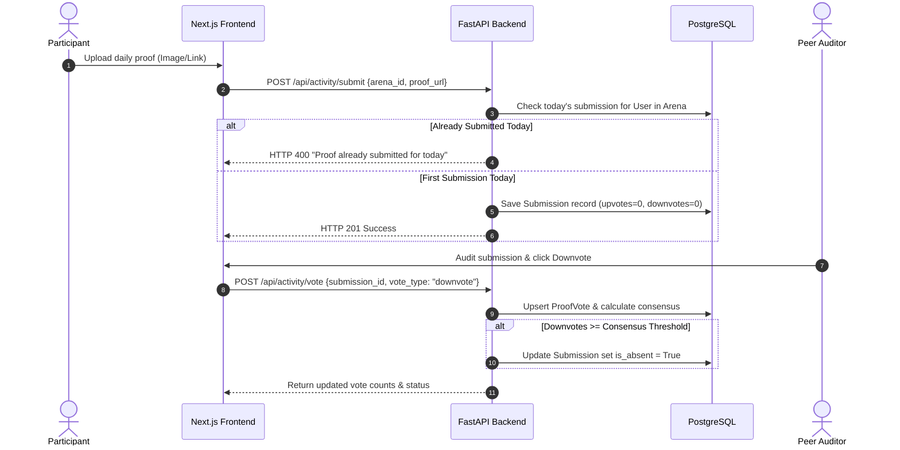

powershell -ExecutionPolicy Bypass -File .\venv\Scripts\Activate.ps1
venv\Scripts\activate.bat

git init
git add .
git commit -m "Initial commit"
git branch -M main
git remote add origin <REMOTE_REPOSITORY_URL>
git push -u origin main


Listed directory Tribely-main
Listed directory backend
Listed directory app
Listed directory frontend
Viewed requirements.txt:1-12
Viewed main.py:1-45
Viewed package.json:1-28
Listed directory src
Listed directory app
Viewed PROJECT_FILE_WISE_SUMMARY.md:1-200
Viewed models.py:1-100

Hey! Great to collaborate with you on this project. 

As an SDE III at Google working alongside an SDE I at Meta, let's conduct a deep-dive architectural audit of **Tribely**. We will break down the system design, domain data models, backend API mechanics, frontend state and routing, core execution flows, and finish with a senior-level technical debt and scalability roadmap so we have a clear, shared mental model before jumping into implementation.

---

# 1. Executive Summary & Product Vision

**Tribely** is a **Full-Stack Social Accountability & Micro-Arena Engine**. 
It addresses the common issue of habit decay and low commitment in solo habit trackers by grouping users into focused **"Arenas"** (micro-communities around specific goals like daily coding, fitness, or reading). 

Within an arena, accountability is enforced through:
1. **Daily Proof Submissions**: Users post proof of goal completion before a daily deadline.
2. **Peer Review & Consensus Validation**: Group members audit and vote (upvote/downvote) on submissions. High downvote ratios trigger automated absence/penalty status.
3. **Real-time Arena Timeline**: Synchronized chat and activity streams powered by persistent WebSockets.

---

# 2. Tech Stack & Repository Structure

The project is structured as a clean **Monorepo**:

```
Tribely-main/
├── backend/                  # FastAPI + SQLAlchemy 2.0 + PostgreSQL + Redis
│   ├── main.py               # Application Entry Point & CORS Setup
│   ├── app/
│   │   ├── api/              # HTTP Routes & WebSocket Controllers
│   │   ├── core/             # DB Config, Security (JWT/Bcrypt), Settings
│   │   ├── crud/             # Data Access Layer (DAL)
│   │   ├── models/           # SQLAlchemy Declarative Models
│   │   └── schemas/          # Pydantic Schemas (Request/Response DTOs)
└── frontend/                 # Next.js 16 (App Router) + React 19 + Tailwind CSS v4
    ├── package.json          # Dependency Manifest
    └── src/
        ├── app/              # App Router Pages & Layouts
        └── components/       # UI Components & Context Providers
```

### Stack Breakdown:
* **Backend**: Python 3.12, [FastAPI](file:///c:/Users/mayur/Downloads/Tribely-main/backend/requirements.txt#L1) (Async API framework), [SQLAlchemy 2.0](file:///c:/Users/mayur/Downloads/Tribely-main/backend/requirements.txt#L3) (ORM), [Pydantic v2](file:///c:/Users/mayur/Downloads/Tribely-main/backend/requirements.txt#L6) (Data validation), [PostgreSQL](file:///c:/Users/mayur/Downloads/Tribely-main/backend/requirements.txt#L4) (Relational Database), [Redis](file:///c:/Users/mayur/Downloads/Tribely-main/backend/requirements.txt#L5) (Caching / PubSub ready), [Passlib/Bcrypt](file:///c:/Users/mayur/Downloads/Tribely-main/backend/requirements.txt#L9) & [PyJWT](file:///c:/Users/mayur/Downloads/Tribely-main/backend/requirements.txt#L8) (Security).
* **Frontend**: Next.js 16 (App Router), React 19, TypeScript, [Tailwind CSS v4](file:///c:/Users/mayur/Downloads/Tribely-main/frontend/package.json#L24) (PostCSS 4 engine), Axios.

---

# 3. Data Architecture & Entity Relationship (ER) Model

The relational schema in [backend/app/models/models.py](file:///c:/Users/mayur/Downloads/Tribely-main/backend/app/models/models.py) follows a robust domain design:

```mermaid
erDiagram
    USER ||--o{ ARENA_MEMBERSHIP : joins
    USER ||--o{ SUBMISSION : posts
    USER ||--o{ MESSAGE : sends
    USER ||--o{ PROOF_VOTE : votes
    USER ||--o1 USER_PROFILE : has

    ARENA ||--o{ ARENA_MEMBERSHIP : contains
    ARENA ||--o{ SUBMISSION : holds
    ARENA ||--o{ MESSAGE : logs
    ARENA ||--o{ ARENA_LOGBOOK : records

    SUBMISSION ||--o{ PROOF_VOTE : receives
```

### Core Schema Highlights:
1. **`User` & `UserProfile`**: Holds authentication credentials (`hashed_password`) and extended metadata (`profile_image_url`). Cascades deletes down to memberships and submissions.
2. **`Arena`**: The micro-group entity. Stores metadata like `proof_type` (image/link/text), `penalty_amount`, `deadline_time`, `invite_code`, and `is_private` status.
3. **`ArenaMembership`**: Junction table establishing user roles (`admin` / `creator` vs `member`) and membership status (`approved` vs `pending`).
4. **`Submission`**: Tracks daily activity. Stores `proof_url`, timestamp, `upvotes`, `downvotes`, and `is_absent` flag.
5. **`ProofVote`**: Prevents vote duplication per user per submission while allowing vote switching (upvote $\leftrightarrow$ downvote).
6. **`Message`**: Real-time room chat history with support for text and system notifications.
7. **`ArenaLogbook`**: System audit trail logging milestone events (e.g. member joins, approvals, penalties).

---

# 4. Backend Engine Deep Dive

The backend entry point [backend/main.py](file:///c:/Users/mayur/Downloads/Tribely-main/backend/main.py) registers modular routers:

### 1. Auth Module (`app.api.auth`)
* **`POST /api/auth/register`**: Hashes passwords via bcrypt, checks email uniqueness, creates a new user, and auto-initializes an empty user profile.
* **`POST /api/auth/login`**: OAuth2-compatible form endpoint. Validates credentials, issues JWT token containing `sub: user_id` with expiration.

### 2. Arenas Module (`app.api.arenas`)
* **`GET /api/arenas/public`**: Discovery feed for open public arenas.
* **`POST /api/arenas/create`**: Generates a unique 6-character alphanumeric `invite_code`, creates the arena, and attaches the creator as an `approved` `admin`.
* **`POST /api/arenas/join`**: Handles direct public joining or private request submission (`pending` state).
* **`POST /api/arenas/join-by-code`**: Allows instant joining via invite code bypass.

### 3. Activity & Consensus Engine (`app.api.activity`)
* **`POST /api/activity/submit`**: Validates same-day single submission rules. Prevents users from submitting multiple proofs on the same calendar day for an arena.
* **`POST /api/activity/vote`**: Implements peer consensus verification:
  $$\text{Downvote Threshold} = \max\left(2, \left\lfloor 0.4 \times \text{Active Members} \right\rfloor\right)$$
  When downvotes reach this threshold, the submission is automatically flagged `is_absent = True`.
* **`GET /api/activity/arena/{id}/history`**: Aggregates submissions and chat messages into a unified timeline sorted chronologically.

### 4. Admin Arena Module (`app.api.admin_arena`)
* Provides role-gated admin controls: fetch pending requests, approve/reject requests, remove members, and generate invite payloads (including QR code data).

### 5. WebSocket Real-time Router (`app.api.websocket`)
* **`WS /ws/arena/{arena_id}`**: Manages in-memory connection pools (`ConnectionManager`), broadcasts incoming messages to active room clients, and persists them via `crud_activity.create_message`.

---

# 5. Frontend Architecture Deep Dive

The Next.js 16 App Router application enforces strict component separation and unified styling:

* **Routing Layer**:
  * `/(auth)`: [`/login`](file:///c:/Users/mayur/Downloads/Tribely-main/frontend/src/app/login), [`/register`](file:///c:/Users/mayur/Downloads/Tribely-main/frontend/src/app/register)
  * Main App: [`/dashboard`](file:///c:/Users/mayur/Downloads/Tribely-main/frontend/src/app/dashboard), [`/arenas`](file:///c:/Users/mayur/Downloads/Tribely-main/frontend/src/app/arenas), [`/arena/[id]`](file:///c:/Users/mayur/Downloads/Tribely-main/frontend/src/app/arena/[id]), [`/profile`](file:///c:/Users/mayur/Downloads/Tribely-main/frontend/src/app/profile)
  * System Pages: `/security`, `/transparency`, `/protocol`, `/support`
* **Theme & UI**: Built with Tailwind CSS v4, supporting glassmorphism aesthetics, responsive layouts, and dark/light system modes.
* **State Management**: React Context (`AuthContext`) manages JWT lifecycle and Axios interceptors for standard bearer token header injection.

---

# 6. Core Execution Flows

### End-to-End Daily Proof & Voting Workflow



---

# 7. Engineering Evaluation & Scalability Roadmap

As an SDE III / SDE I pair, here is our tactical engineering review of what's great and what we should improve in our upcoming sprints:

### System Strengths
 clean layering (`api` $\to$ `crud` $\to$ `models`).
 Strict relational schema integrity with CASCADE deletes.
 Micro-arena consensus model instead of central moderation.
 Dynamic, modern frontend UI with complete responsive layout support.

### Proposed Improvement Backlog (Next Steps)

| Area | Current State | Target Architecture | Priority |
| :--- | :--- | :--- | :--- |
| **Real-time Scaling** | In-memory `ConnectionManager` (single server node) | **Redis Pub/Sub adapter** to sync WebSockets across multiple FastAPI workers/instances | P0 |
| **File Storage** | Base64 strings / Raw URLs | **S3 / Cloudflare R2 presigned URLs** for direct browser uploads | P0 |
| **Background Tasks** | No automated timer engine | **Celery / ARQ cron jobs** for midnight deadline evaluation, streak resets, and automated penalty logging | P1 |
| **Security & Rate Limiting** | Open routes without rate limiting | **Redis Leaky Bucket middleware** (e.g. `slowapi`) to mitigate brute force on `/login` and submit endpoints | P1 |
| **Test Coverage** | Manual testing setup | **Pytest + Testcontainers** backend test suite + Playwright E2E frontend integration | P1 |

---

### Next Action Plan
When you are ready to begin coding, let me know which area you'd like to tackle first! We can start with **Redis Pub/Sub WebSocket scaling**, **AWS S3 file upload integration**, or setting up an **Automated Celery background task engine**.